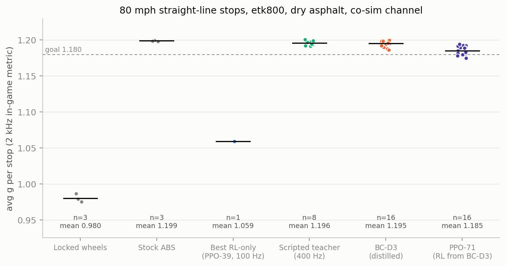

# Learned Anti-Lock Braking in BeamNG

A training environment for anti-lock braking controllers inside BeamNG.drive
and BeamNG.tech, built around the game's co-simulation coupling and its own
2 kHz brake metric. PPO and SAC reinforcement learning, supervised distillation
from scripted and classical teachers, and the tooling to measure all of it
against stock ABS on the same car and test.

**Where it stands (2026-09-09):** a sensor-only policy network distilled from a
400 Hz scripted slip regulator stops at 1.195 g on an etk800 at 80 mph. Stock
ABS stops at 1.199 g. The policy does not beat stock ABS. Reinforcement
learning alone reached 1.059 g. The full record, including what failed and
what is unexplained, is in **[docs/RESULTS.md](docs/RESULTS.md)**.



## The idea

The trained action is a per-axle **release from the driver's brake pedal**, not the
brake level itself. Zero action = full pedal slam = the known lockup baseline.
Training starts at the anti-lock boundary instead of discovering "brake hard" first.
Reward is g-force only (per-step + terminal shape).

## Setup

```bash
pip install -r requirements.txt
python -m pytest tests -q
```

Requires a BeamNG.tech or BeamNG.drive install. `beamngpy` must match your game
version's wire protocol (see `requirements.txt`).

## Quick start: co-sim PPO (current default)

Launch `gui_train.py`, select `cosim`, configure the run, and press Start. The GUI
handles simulator setup, training, and live monitoring. Graceful stop writes a
marker file. Never kill the trainer process.

Or from the command line:

```bash
python train_cosim.py --config config.json
```

See [docs/REFERENCE.md](docs/REFERENCE.md) for the full config.json schema and
output file formats.

## Quick start: legacy residual backend

```bash
python train_residual.py --algo sac --speeds "60" --pedal off \
    --total-steps 10000 --run-name smoke_sac
```

Or launch `gui_train.py` and select the residual backend. Supports SAC and PPO.

## Layout

**Environments:**

- `abs_env.py`, `abs_env_incar.py`: base in-car training environment.
- `abs_env_cosim.py`: co-sim environment (current default).
- `abs_env_residual.py`: residual (release-from-pedal) env subclass.
- `cosim_link.py`: UDP co-simulation transport.

**Trainers:**

- `train_cosim.py`: co-sim PPO trainer (the GUI's default backend).
- `train_residual.py`: legacy in-car SAC/PPO trainer.
- `bounded_ppo.py`: affine-tanh action distribution and checkpoint contract.

**Distillation (teacher to student):**

- `slip_ceiling_probe.py`: scripted teachers (constant release, bang-bang,
  proportional slip regulator) through the co-sim env, with `--record` and
  `--dagger` for collecting (obs, act) pairs.
- `record_dynamicabs_teacher.py`: records the DynamicABS-Trainer 400 Hz classical
  controller as a teacher via an in-game Lua recorder. Works on BeamNG.drive.
- `distill_teacher.py`: supervised distillation from a recorded teacher into the
  same PPO network `train_cosim.py` trains.

**GUI:**

- `gui_train.py`: tkinter launcher and live monitor.
- `gui_cmd.py`: settings-to-argv translation and pre-launch validation.
- `gui_help.py`: inline help text.
- `gui_state.py`: field persistence.
- `train_monitor.py`, `train_progress.py`: live training stats.

**Evaluation and output:**

- `evaluate_cosim.py`: frozen checkpoint evaluation and best-pair preservation.
- `export_policy_weights.py`: exports trained weights to a deployable Lua blob.
- `mod_output.py`, `jbeam_generator.py`: generate the BeamNG mod for deployment.
- `model_registry.py`: lists finished runs for the GUI.

**Calibration and validation:**

- `calibration.py`, `calibration_progress.py`: per-config baseline measurement.
- `reference_runner.py`: automated slam/stock baseline runner.
- `baseline_probe.py`: sanity gates before trusting a training config.
- `simulator_guard.py`: pre-flight simulator checks.

**Reward and config:**

- `reward_spec.py`: reward presets (v5.0 through v11.0).
- `residual_core.py`: action-space math and CLI arg parsing.
- `sim_config.py`: simulator settings (game path, port, headless, map).
- `sim_clock.py`: frame limiter management.
- `corner.py`: arc geometry and steering seek for corner training.

**Shared:**

- `residual_log.py`: logging setup (GUI, trainer, probe each get their own file).
- `compat.py`: beamngpy version compatibility checks.
- `vehicle_scanner.py`: scans game zips for car models and trims.
- `asset_installer.py`: deploys mod files to the game userpath.
- `experiment_io.py`: atomic checkpoint pairs, validation, run state.
- `training_diagnostics.py`: per-rollout and per-episode diagnostic artifacts.

**In-game:**

- `abstelemetry.lua`: telemetry bridge and per-wheel brake control (2 kHz).
- `assets/mods/mtb_ml_abs/`: the ML ABS mod (policy controller Lua, jbeam part,
  telemetry bridge).
- `assets/mods/dynamicabs_trainer/`: the DynamicABS-Trainer classical PID slip
  regulator (400 Hz) plus its 400 Hz recorder extension, used as a teacher.
- `assets/cars/etk800/`: reference car configs. The teacher car is the student car
  with only the ABS slot swapped (enforced by test).

**Tests:**

- `tests/`: 735 offline unit and integration tests.

**Docs:**

- `docs/RESULTS.md`: what worked, what did not, what is unexplained, with charts.
- `docs/REFERENCE.md`: technical reference (reward design, GUI contract, config
  schema, performance notes).
- `docs/data/`: the per-stop CSVs behind every chart, and `runs_table.csv`, one
  row per training run.
- `docs/make_charts.py`: regenerates `docs/charts/` from `docs/data/`.

## The metric

All performance numbers use the standardized 2 kHz brake metric
(`last_brake_avg_g` / `last_brake_dist`) computed by `abstelemetry.lua` inside the
game's physics loop. Never self-computed, never frame-rate.
