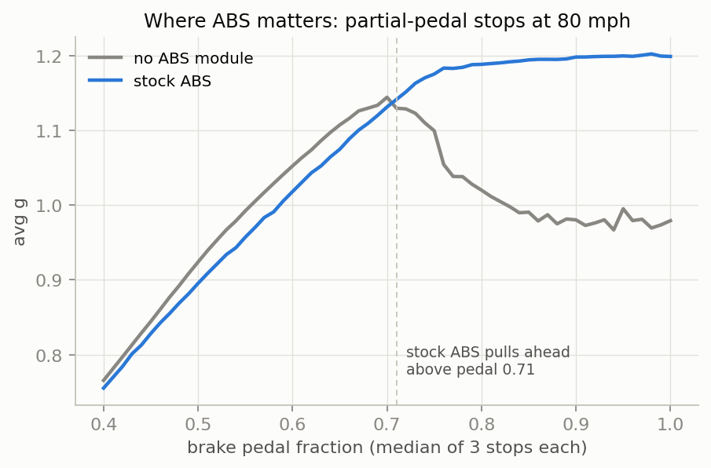
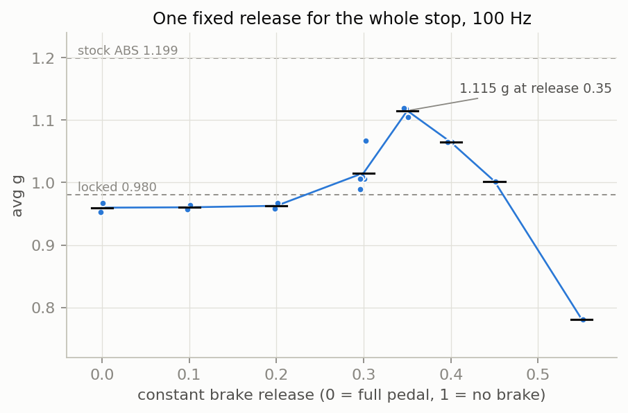
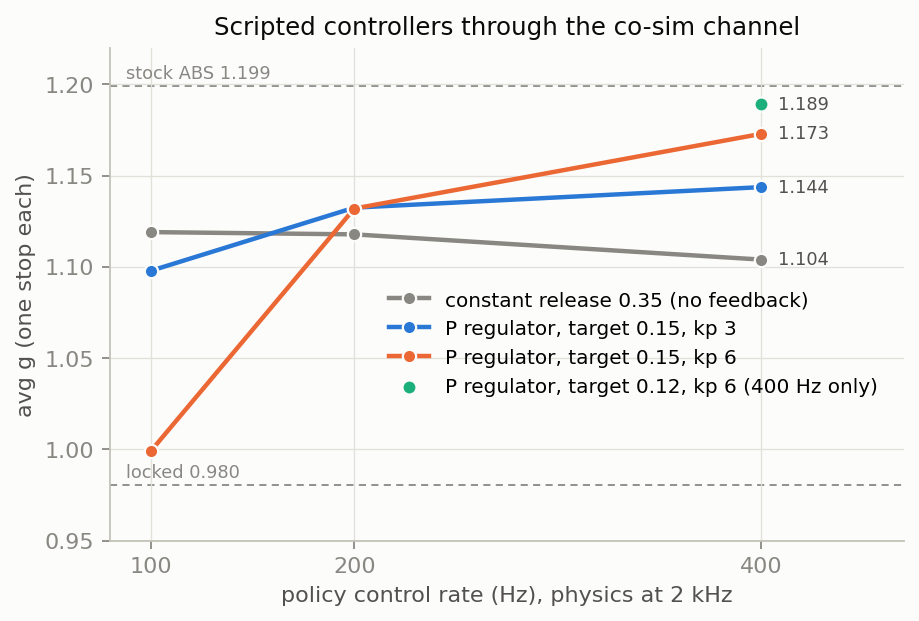
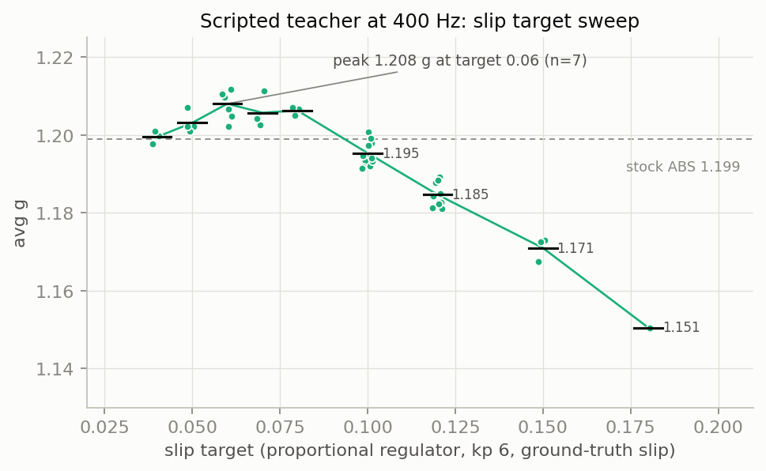
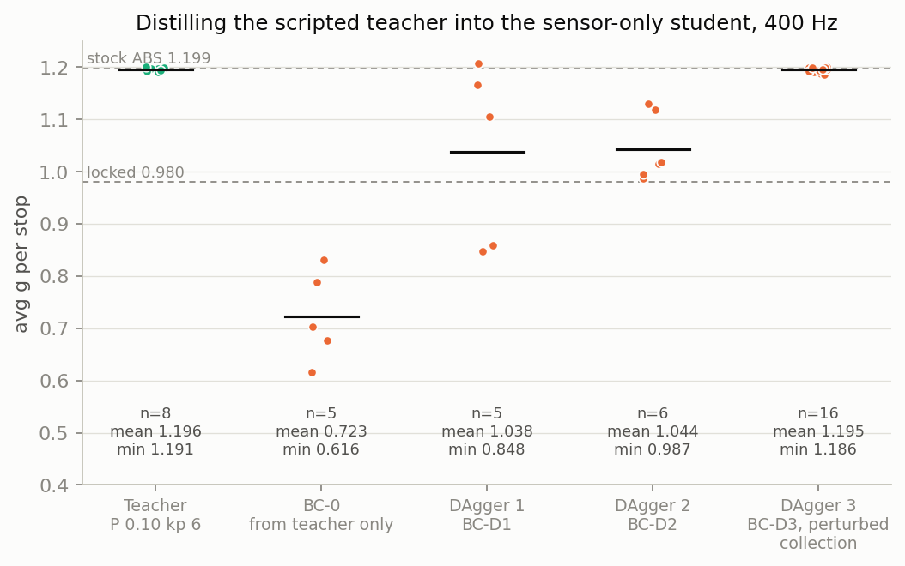
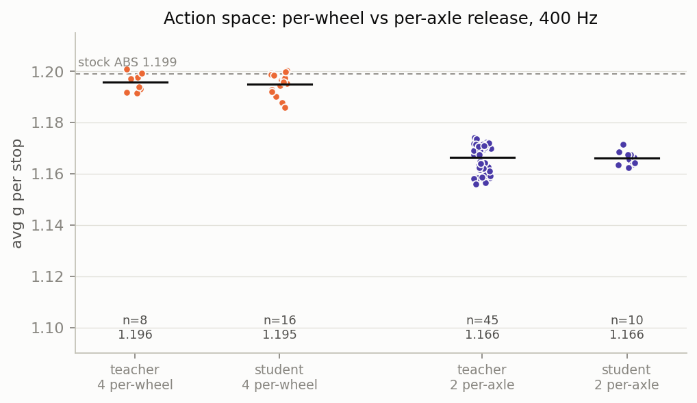
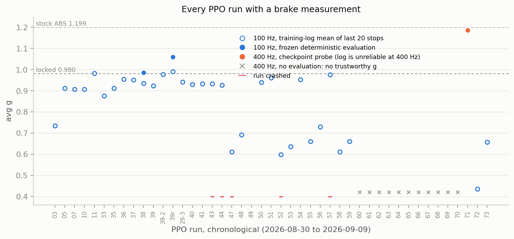
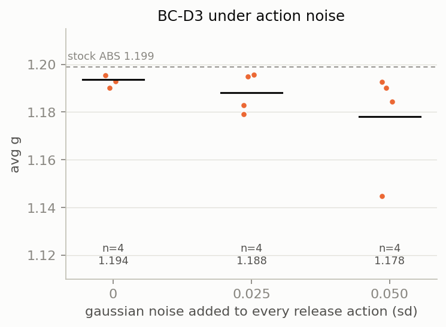

# Results

Twelve days of experiments (2026-08-29 to 2026-09-09), 81 training runs, one
converged result. All numbers are the in-game 2 kHz brake
metric (`avg_g`, see README) on one car (etk800, `Machine-Trainer-Boy-V2-MLABS.pc`),
one surface (dry asphalt, smallgrid), one speed (80 mph), straight line. The raw
per-stop data behind every chart is committed under `docs/data/` and every chart
is regenerated by `python docs/make_charts.py`.

References measured on the same car and test (`calibration/etk800.json`, n=3 each):

| reference | avg g |
|---|---:|
| locked wheels, no ABS module | 0.979 |
| stock BeamNG ABS (in-car, 2 kHz) | 1.199 |
| project goal | 1.180 |


## 1. Headline


A 3x256 policy network that reads only sensor-derived inputs (wheel speeds,
stock-ABS slip estimate, applied brake torque, IMU) stops at **1.195 g**
(n=16, min 1.186, max 1.200, 16/16 above the goal). Stock ABS on the same car and
test stops at 1.199 g. The policy does not exceed stock ABS. It is 0.004 g short.

It was not trained by reinforcement learning. It was distilled from a scripted
proportional slip regulator running at 400 Hz. The best result RL alone produced
in this project was 1.059 g. Fine-tuning the distilled policy with RL (PPO-71,
1.5M steps) ended at 1.185 g, below its starting point.

Sources: `docs/data/probes/d3_confirm.csv`, `ppo71_confirm.csv`,
`teacher_probe3.csv`; PPO-39 from its frozen evaluation (`runs_table.csv`,
column `eval_g`).


## 2. The problem, measured

### 2.1 Where ABS matters on this car



Median of 3 stops at each pedal fraction, no ABS module vs stock ABS. Below
pedal 0.71 the no-ABS stop is 0.01 to 0.03 g shorter than stock ABS at the same
pedal. Above 0.71 the no-ABS line falls and stock ABS keeps climbing to 1.20.
The gap the controller has to close is the 0.22 g between a locked wheel and
stock ABS at full pedal. Source: `calibration/etk800.json`.

### 2.2 The optimum is narrow



One fixed brake release held for the whole stop, no feedback. The best constant
(release 0.35, 1.115 g, n=4) beats every RL policy the project trained.
Release 0.30 gives 1.016 (n=5) and release 0.40 gives 1.065 (n=4). PPO-57's converged action
distribution had a deterministic mean of 0.277 and an exploration std of 0.21
(REFERENCE.md section 5.2). Sources: `const_100hz_low.csv`,
`const_cosim_100hz.csv`, `slip_ceiling_probe2.csv`.


## 3. What worked

### 3.1 Control rate



The policy talks to the game through BeamNG's co-simulation coupling. The
control period is set by `time3rdParty`; physics runs at 2 kHz. At 100 Hz a
proportional slip regulator with kp 6 is worse than the best constant (0.999 vs
1.119). At 400 Hz the same regulator reaches 1.173, and target 0.12 reaches
1.189. The constant moves 0.015 across the three rates.

Every RL run before this measurement was at 100 Hz. Sources: `slip_ceiling_probe2.csv`
(100 Hz), `probe_200hz.csv`, `probe_400hz.csv`. One stop per point.

### 3.2 The scripted teacher



Proportional regulator, `release = kp * (slip - target)`, per wheel, kp 6,
400 Hz, reading ground-truth slip from the physics. Peak 1.208 g at target 0.06
(n=7). Target 0.10 was used as the teacher (1.196, n=8) before the low-target
sweep was run. Sources: `target_sweep_low.csv`, `target_sweep_fine.csv`,
`probe_400hz.csv`, `teacher_probe*.csv`.

### 3.3 Distillation with a perturbed student



The teacher reads ground-truth slip. The student cannot. It reads the same
35-value observation frame the RL policy reads, stacked 64 deep.

| stage | data | pairs | student avg g |
|---|---|---:|---:|
| BC-0 | teacher demonstrations only | 23,676 | 0.723 (n=5) |
| DAgger 1 | + states BC-0 visited, teacher-labelled | 42,523 | 1.038 (n=5) |
| DAgger 2 | + states DAgger 1 visited | 63,836 | 1.044 (n=6) |
| DAgger 3 | + states DAgger 2 visited **with gaussian action noise sd 0.04** | . | **1.195 (n=16)** |

DAgger 1 and 2 collected with the student acting deterministically and
plateaued at 1.04, with per-stop values spanning 0.85 to 1.21 inside one
evaluation. DAgger 3 collected with gaussian noise on the student's actions and
reached 1.195. Sources: `bc_eval.csv`, `d1_eval.csv`, `d2_eval.csv`,
`d3_confirm.csv`.

### 3.4 Per-wheel actions



The deployed in-car controller contract accepts two actions (front release,
rear release, left equals right). Through that contract the same teacher and
distillation reach 1.166 g. Four independent wheel releases reach 1.195. The
0.03 g difference holds for the teacher and the student alike. Sources:
`teacher_deploy2.csv`, `deploy_final.csv`, `teacher_probe3.csv`, `d3_confirm.csv`.


## 4. What did not work

### 4.1 Reinforcement learning from scratch



Every PPO run with a brake measurement, in order. Hollow circles are the
training log's mean over the last 20 stops. Filled circles are a frozen
deterministic evaluation of the checkpoint. The best RL-only result was PPO-39
at 1.059 g (50 stops, 0 failures), reward v6.0, 100 Hz, 1M steps.

Reward versions v6.0, v6.1, v7.0, v8.0, v3.3, v9.0, v11.0 and network sizes
256 and 512 were tried across PPO-33 to PPO-59. None crossed 1.11 in the
training log or 1.06 in evaluation. The control-rate measurement in section
3.1 was made after PPO-59.

### 4.2 Reinforcement learning at 400 Hz

Thirteen runs (PPO-60 to PPO-70, PPO-72, PPO-73) trained at 400 Hz or with the
v11 reward at 100 Hz. All but PPO-71 were stopped early by hand with no
evaluation. At 400 Hz the control period is 2.5 ms and the trainer's per-step
Python cost is 1.6 to 2.0 ms of it. Measured g falls as that cost rises
(REFERENCE.md section 6.3), and PPO-71 logged 0.85 while its checkpoint
measures 1.185. The training-log g at 400 Hz is not a measurement of the
policy. These runs have no trustworthy g. They are marked with an x on the chart.

PPO-71, the one completed 400 Hz run, started from BC-D3 (1.195) with a
learning rate of 1e-5 and finished at 1.185 (n=16). Fine-tuning made it worse.

### 4.3 Sensitivity to action noise



BC-D3 with gaussian noise added to every release action. At sd 0.05 the mean
drops to 1.178 and one stop of four fell to 1.145. Sources: `noise_*.csv`.

### 4.4 Infrastructure

- PPO-20 through PPO-32 (13 runs, 08-30 to 08-31) logged `avg_g = 0.0` on every
  episode. No brake measurement exists for them.
- Six runs (PPO-42, 43, 44, 46, 47, 57) ended on simulator connection loss.
  PPO-57 was at 1.49M of 2M steps.
- PPO-52 ended at 2.29M steps with NaN in the policy distribution.
  `bounded_ppo.py` attributes it to SB3's sampled-entropy estimate growing
  without bound once tanh saturates in float32, and replaces it with the
  analytic Gaussian entropy plus a bound on the latent mean. No later run
  reproduced the NaN.
- The co-sim UDP link did not drain between episodes. Up to 1618 stale packets
  (4 s at 400 Hz) fed the observation stack at the start of every episode. Found
  and fixed 2026-09-06. Every run before that ran with this bug.
- `PPO.load()` ignored the configured learning rate on resume, so every fine-tune
  before 2026-09-06 ran at the checkpoint's original 3e-4 while logging 1e-5.
  Fixed the same day.


## 5. Not explained

The data does not say why these happened. No cause is claimed.

- PPO-20 to PPO-32: zero brake metric on every row. Cause not recorded.
- PPO-38: ended at 549k of 1M with no final checkpoint. Cause not recorded.
- PPO-38: evaluation g declined from 0.985 at step 252k to 0.936 at 502k. The
  ledger names front near-lock rising 0.73 to 0.90 as a hypothesis, pending
  replication. PPO-39 (same config, new seed) did not show the decline.
- Six simulator connection losses. The crash logs record the socket error, not
  what ended the simulator.
- PPO-71 finishing below its BC-D3 starting point. Cause not recorded.
- Below pedal 0.71, stock ABS stops 0.01 to 0.03 g shorter than no ABS at the
  same pedal (section 2.1). Not investigated.


## 6. Run history

`docs/data/runs_table.csv` has one row per run: reward, control rate, wheel
mode, steps, episode count, best and mean g from the log, evaluation g where
one exists, status, and notes. `experiments/ledger.jsonl` (not committed) holds
hypotheses for PPO-38 and PPO-39 only. Runs after PPO-39 have no recorded
hypothesis.

| date | runs | what changed | result |
|---|---|---|---|
| 08-29 | PPO-01 to 12 | residual in-car backend | PPO-10 best 1.003, mean 0.914 |
| 08-30 | PPO-20 to 32 | first co-sim runs | no metric recorded |
| 08-31 | PPO-33 to 37 | co-sim with metric, reward v6.0 | 0.95 log mean |
| 09-01 | PPO-38 | 1M steps v6.0 | eval 0.985, late decline |
| 09-02 | PPO-39 | replication, new seed | eval 1.059, 50/50 stops |
| 09-03 | PPO-40 to 51 | reward v7.0, independent wheels | 5 crashes, best 1.064 log |
| 09-04 | PPO-52 to 56 | v6.1, v7.0, v8.0 | NaN crash at 2.29M |
| 09-05 | PPO-57 | v8.0, 512 net, 2M | crash at 1.49M, eval 0.996 |
| 09-06 | probes | control rate sweep | P regulator 1.189 at 400 Hz |
| 09-06 | PPO-58 to 63 | v3.3, v9.0, v11.0, 100 to 400 Hz | stopped, no eval |
| 09-06 | BC-0 to BC-D3 | distillation | 0.723 to 1.195 |
| 09-06 | PPO-64 to 71 | RL fine-tune from BC | PPO-71 1.185 |
| 09-09 | PPO-72, 73 | v11.0 at 100 Hz from scratch | stopped early |


## 7. Reproduce

```bash
# references (needs a running BeamNG, see README)
python reference_runner.py

# control-rate probe
python slip_ceiling_probe.py --reps 1 --dt 0.01   --prop "0.15:3,0.15:6" --releases "0.35"
python slip_ceiling_probe.py --reps 1 --dt 0.0025 --prop "0.15:3,0.15:6,0.12:6" --releases "0.35"

# record the teacher, distill, DAgger with the student perturbed
python slip_ceiling_probe.py --reps 8 --dt 0.0025 --releases "" --targets "" --prop "0.10:6" --record teacher.npz
python distill_teacher.py --data teacher.npz --config docs/data/distill_config.json --out runs/BC-1 --epochs 80
python slip_ceiling_probe.py --reps 14 --dt 0.0025 --releases "" --targets "" --policy runs/BC-1 --policy-noise 0.04 --dagger "0.10:6" --record dagger.npz

# evaluate a checkpoint
python slip_ceiling_probe.py --reps 16 --dt 0.0025 --releases "" --targets "" --policy runs/BC-D3

# charts
python docs/make_charts.py
```
